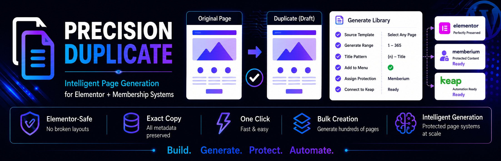

# Precision Duplicate

Precision Duplicate helps generate structured WordPress page systems using intelligent duplication workflows, range generation, title patterns, slug patterns, and optional sequential tagging.

---

## ✨ Features

* One-click duplication of posts, pages, and custom post types
* Bulk duplicate pages
* Preserves all metadata exactly (no parsing or corruption)
* Elementor-safe duplication (prevents broken layouts)
* Automatically avoids stale Elementor CSS
* Works with Gutenberg, Classic Editor, and Elementor
* Lightweight and fast

---

## 🧠 Why this plugin exists

Most duplicate plugins break Elementor pages because they re-save or modify structured meta data.

Precision Duplicate solves this by:

* Copying meta data exactly as stored
* Avoiding mutation of Elementor JSON
* Letting Elementor regenerate styles cleanly

---

## 🚀 Bulk Library Page Creation

Includes a built-in tool for creating multiple draft pages at once:

* Go to **Tools → Precision Duplicate**
* Generate large batches of pages (perfect for structured libraries like Day Text ranges)
* Designed to work safely with Elementor and metadata-heavy pages

---

## 🔄 GitHub Auto Updates

This plugin supports version checking and updates via GitHub:

* Connects to the repository:
  https://github.com/LightMoving/precision-duplicate/
* Notifies you when new versions are available
* Keeps your installation up to date easily

---

## 🔧 Installation

1. Upload the plugin to `/wp-content/plugins/`
2. Activate the plugin
3. Go to Posts or Pages
4. Click **Duplicate**

---

## ⚠️ Notes

* Designed to preserve complex page builders and meta-driven layouts
* Uses direct database operations intentionally to avoid data corruption
* Plugin Checker warnings related to database queries are expected and intentional

---

## 🔗 Repository

https://github.com/LightMoving/precision-duplicate/

---

## 📄 License

GPL v2 or later

